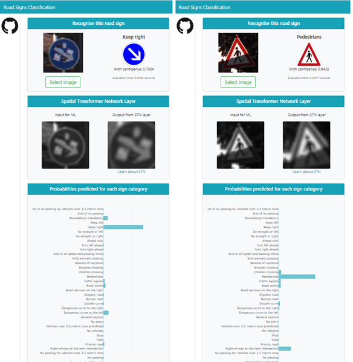
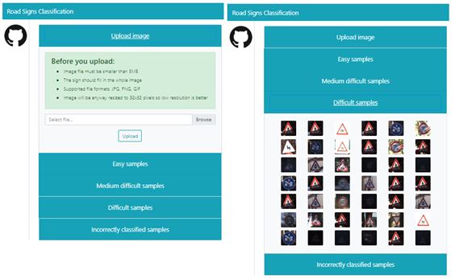

# ml_road_signs_web

Road sign recognition web appliation.
Try it live: https://rscwebapp.herokuapp.com  

Backend is based on Flask and uses PyTorch CNN model.
Model training project: https://github.com/j99nowicki/ml_road_signs 

# Example screenshots

Main page views with example inferences: <br>


Input file selection options: <br>


# Deployment instructions 

## Local deoloyment

To run the project locally:
1. Clone this repository

2. Create a python environment, for example rscwebapp (this is a local environemtn only)
```
    python -m venv rscwebapp
```
3. Activate the environemnt
```
    source rscwebapp/Scripts/activate
```
5. Update requirements.txt

    For Heroku deployemnt, torch and torchvision packages are deployed with hardcoded URLs to exact distributions.
    Your environemnt might be differnt, so first replace them with:
```
        torch==1.5.0+cpu
        torchvision==0.0.6+cpu
```

4. Install dependencies from requirements.txt
```
    pip install -r [path to requirements.txt]
```
5. Start the application locally 
```
    python rsc_webapp.py
```
    Note: your computer will need outgoing connectivity to Internet, so check your system proxy settings or connect without proxy.

6. In the browser go to: http://127.0.0.1:3001/


## Deployemtn in Heroku

1. Create Heroku account

2. Create Heroku application following this guide: https://devcenter.heroku.com/articles/creating-apps, give it unique name [HEROKU APP NAME]

3. Add this repository into Heroku application directory 
```
    git remote add github https://github.com/j99nowicki/ml_road_signs_web.git
```
    Inspect git remote repos, you should see two:
```
    git remote -v
    github  https://github.com/j99nowicki/ml_road_signs_web.git (fetch)
    github  https://github.com/j99nowicki/ml_road_signs_web.git (push)
    heroku  https://git.heroku.com/[HEROKU APP NAME].git (fetch)
    heroku  https://git.heroku.com/[HEROKU APP NAME].git (push)
```
4. Pull this git repository and merge them 
```
    git pull github master --allow-unrelated-histories 
```
5. Push the app to heroku
```
    git push heroku master
```
6. When the push completes, visit your application URL: https://[HEROKU APP NAME].herokuapp.com

